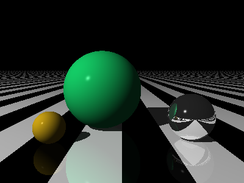

# *The Ray Tracer Challenge* ... in Scala

A 3D ray tracer implementation in Scala 3, following Jamis Buck's *The Ray Tracer Challenge*.

This project was implemented as a learning experience using Anthropic's Claude as an AI coding assistant, exploring how AI tooling can enhance the software development process.

## Features

This ray tracer currently supports:

### Core Rendering
- **Ray-object intersection** for spheres and planes
- **Phong lighting model** with ambient, diffuse, and specular components
- **Shadows** with accurate shadow ray calculations
- **Camera system** with configurable field of view and transforms
- **PPM image output** for rendered scenes

### Materials & Patterns
- **Material properties**: color, ambient, diffuse, specular, shininess
- **Surface patterns**: stripes, rings, gradients, checkerboards, and 3D checkerboards
- **Pattern transformations**: scaling, rotation, translation
- **Test patterns** for debugging and development

### Advanced Effects
- **Reflections** with configurable reflectivity and recursive depth limiting

### Geometry & Transformations
- **3D transformations**: translation, scaling, rotation, shearing
- **View transformations** for camera positioning
- **Matrix operations** with 4x4 homogeneous coordinates
- **Vector math** with proper tuple handling for points and vectors

## Sample Output

The raytracer can render complex scenes with multiple objects, reflections, and realistic lighting:



## Getting Started

### Prerequisites
- Scala 3.6.4 or later
- sbt (Scala Build Tool)

### Running the Raytracer

1. **Clone the repository**:
   ```bash
   git clone <repository-url>
   cd raytracerchallenge-scala
   ```

2. **Compile and run**:
   ```bash
   sbt run
   ```

3. **View the output**:
   The raytracer will generate a `render.ppm` file in the project root. You can view this with any image viewer that supports PPM format, or convert it to other formats using tools like ImageMagick:
   ```bash
   convert render.ppm render.png
   ```

### Running Tests

The project includes comprehensive test suites covering all features:

```bash
sbt test
```

## Project Structure

- `src/main/scala/` - Core raytracer implementation
  - `Main.scala` - Demo scene with spheres, planes, and lighting
  - `Ray.scala`, `Sphere.scala`, `Plane.scala` - Geometric primitives
  - `Material.scala`, `Pattern.scala` - Surface properties and patterns
  - `Camera.scala`, `World.scala` - Scene and camera management
  - `Color.scala`, `Canvas.scala` - Color handling and image generation
  
- `src/test/scala/` - Comprehensive test suites
- `docs/` - Documentation and sample images

## Scene Configuration

The default scene (in `Main.scala`) renders:
- A black and white striped floor plane with reflectivity
- Three spheres with different materials:
  - **Middle sphere**: Green with medium reflectivity
  - **Right sphere**: Highly reflective metallic surface
  - **Left sphere**: Matte yellow-orange surface
- Point light source positioned above and to the left

You can modify the scene by editing `Main.scala` to experiment with different:
- Object positions and scales
- Material properties (colors, reflectivity)
- Lighting conditions
- Camera angles and positions
- Surface patterns

## Architecture

The raytracer follows object-oriented principles with functional programming patterns:
- **Immutable data structures** for geometric and material properties
- **Pure functions** for mathematical operations
- **Type safety** with Scala's strong type system
- **Modular design** with clear separation of concerns

Built with modern Scala 3 features and tested with munit for reliability.
