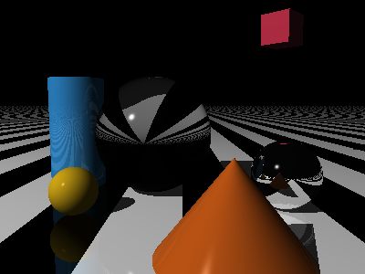

# *The Ray Tracer Challenge* ... in Scala

A 3D ray tracer implementation in Scala 3, following Jamis Buck's *The Ray Tracer Challenge*.

This project was implemented as a learning experience using Anthropic's Claude as an AI coding assistant, exploring how AI tooling can enhance the software development process.

## Features

This ray tracer currently supports:

### Core Rendering
- **Ray-object intersection** for spheres, planes, cubes, cylinders, and cones
- **Quadric surface support** with shared geometry handling for cylinders and cones
- **Hierarchical scene graphs** with groups supporting parent-child relationships
- **Phong lighting model** with ambient, diffuse, and specular components
- **Shadows** with accurate shadow ray calculations
- **Camera system** with configurable field of view and transforms
- **PPM image output** for rendered scenes

### Materials & Patterns
- **Material properties**: color, ambient, diffuse, specular, shininess, reflectivity, transparency, refractive index
- **Surface patterns**: stripes, rings, gradients, checkerboards, and 3D checkerboards
- **Pattern transformations**: scaling, rotation, translation
- **Test patterns** for debugging and development

### Advanced Effects
- **Reflections** with configurable reflectivity and recursive depth limiting
- **Transparency and Refraction** with Snell's law and refractive indices
- **Fresnel effects** using Schlick approximation for realistic glass materials
- **Total internal reflection** for accurate light behavior in transparent objects

### Geometry & Transformations
- **Primitive shapes**: spheres, planes, cubes, cylinders (with caps), and cones (with caps)
- **Group objects**: hierarchical containers for organizing complex scenes
- **Constrained primitives**: cylinders and cones with configurable height limits
- **3D transformations**: translation, scaling, rotation, shearing with full hierarchy support
- **Coordinate space conversions**: world-to-object and object-to-world transformations
- **View transformations** for camera positioning
- **Matrix operations** with 4x4 homogeneous coordinates
- **Vector math** with proper tuple handling for points and vectors

## Sample Output

The raytracer can render complex scenes with multiple objects, transparency, refraction, reflections, and realistic lighting:



## Getting Started

### Prerequisites
- Scala 3.6.4 or later
- sbt (Scala Build Tool)

### Running the Raytracer

1. **Clone the repository**:
   ```bash
   git clone <repository-url>
   cd raytracerchallenge-scala
   ```

2. **Compile and run**:
   ```bash
   sbt run
   ```

3. **View the output**:
   The raytracer will generate a `render.ppm` file in the project root. You can view this with any image viewer that supports PPM format, or convert it to other formats using tools like ImageMagick:
   ```bash
   convert render.ppm render.png
   ```

### Running Tests

The project includes comprehensive test suites covering all features:

```bash
sbt test
```

## Project Structure

- `src/main/scala/` - Core raytracer implementation
  - `Main.scala` - Demo scene with spheres, planes, cubes, cylinders, cones, and lighting
  - `Ray.scala`, `Sphere.scala`, `Plane.scala`, `Cube.scala`, `Cylinder.scala`, `Cone.scala` - Geometric primitives
  - `Group.scala`, `Shape.scala` - Hierarchical scene graph with parent-child relationships
  - `QuadricShape.scala` - Base class for quadric surfaces (cylinders and cones)
  - `Material.scala`, `Pattern.scala` - Surface properties and patterns with hierarchy support
  - `Camera.scala`, `World.scala` - Scene and camera management
  - `Color.scala`, `Canvas.scala` - Color handling and image generation
  
- `src/test/scala/` - Comprehensive test suites
- `docs/` - Documentation and sample images

## Scene Configuration

The default scene (in `Main.scala`) renders a complex scene showcasing all raytracer features:

### Scene Elements
- **Striped floor plane**: Black and white stripe pattern with reflectivity
- **Three spheres** with different advanced materials:
  - **Middle sphere**: Transparent glass sphere with refraction (refractive index 1.5)
  - **Right sphere**: Highly reflective metallic surface with minimal diffuse lighting
  - **Left sphere**: Matte yellow-orange surface with standard diffuse/specular properties
- **Red cube**: Positioned in the background with 45° rotation and scaling
- **Blue cylinder**: Closed caps, positioned on the left side with custom height (0-2)
- **Orange cone**: Closed caps, positioned in the foreground with custom height (-1-0)
- **Point light source**: Positioned above and to the left for dramatic lighting

### Advanced Features Demonstrated
- **Transparency and refraction**: Glass sphere shows light bending through transparent materials
- **Reflections**: Multiple objects reflect in the metallic sphere and floor
- **Surface patterns**: Striped floor pattern with proper transformations
- **Complex materials**: Mix of matte, metallic, and glass surfaces
- **Shadows**: Accurate shadow casting from all objects
- **Constrained primitives**: Cylinder and cone with custom height limits and caps

You can modify the scene by editing `Main.scala` to experiment with different:
- Object positions and scales
- Material properties (colors, reflectivity, transparency, refractive indices)
- Surface patterns and their transformations
- Lighting conditions and shadow effects
- Camera angles and positions
- Primitive constraints (cylinder/cone height limits)

## Architecture

The raytracer follows object-oriented principles with functional programming patterns:
- **Immutable data structures** for geometric and material properties
- **Hierarchical scene graphs** with proper parent-child relationship management
- **Coordinate space transformations** supporting complex nested object hierarchies
- **Pure functions** for mathematical operations and transformations
- **Type safety** with Scala's strong type system
- **Modular design** with clear separation of concerns

### Group System Features
- **Parent-child relationships**: Objects inherit transformations from their parent groups
- **Recursive transformations**: `worldToObject` and `normalToWorld` functions traverse the hierarchy
- **Pattern support**: Surface patterns work correctly on grouped objects through proper coordinate conversions
- **Memory efficient**: Single primitive definitions can be reused across multiple group instances

Built with modern Scala 3 features and comprehensively tested with munit (300+ tests) for reliability.
